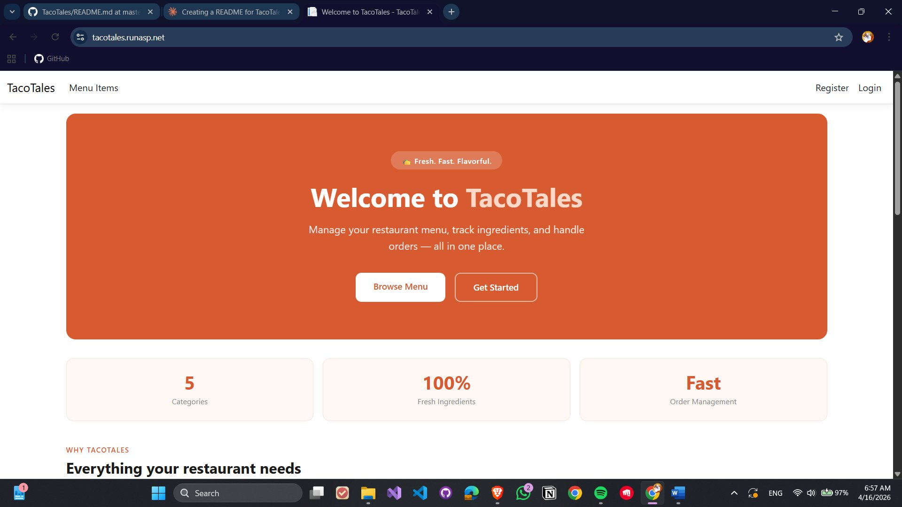
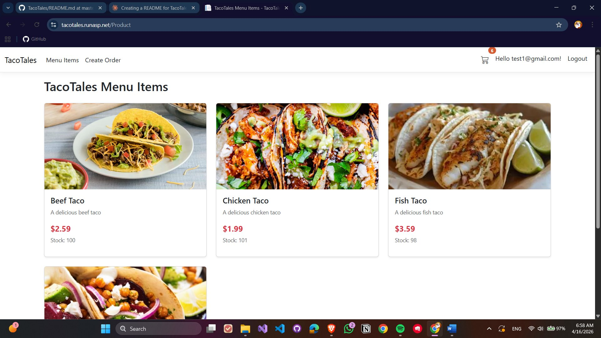
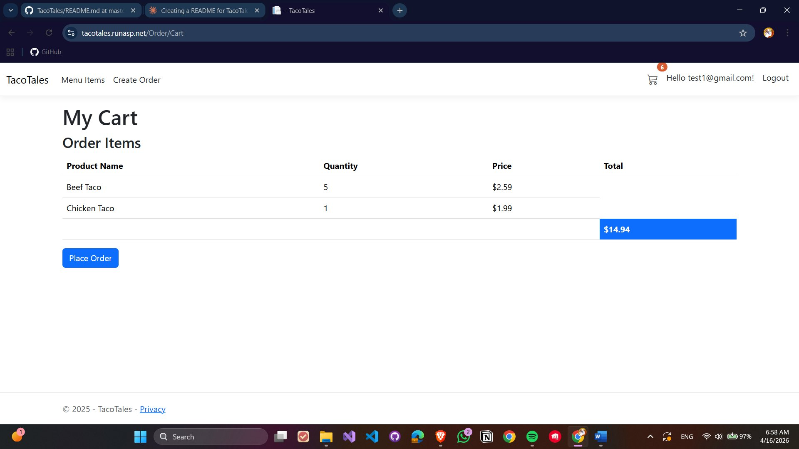
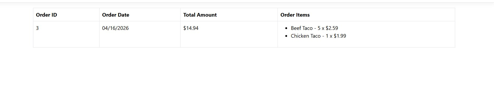
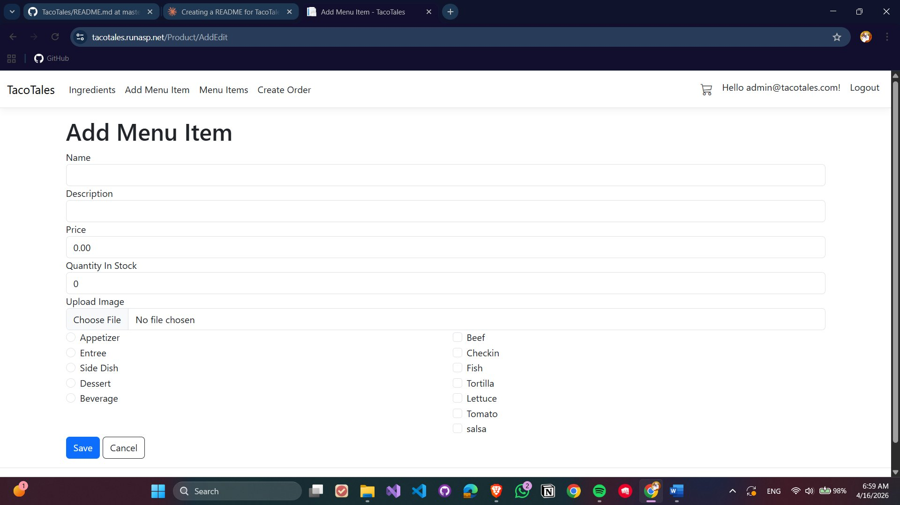

# 🌮 TacoTales

**A full-featured restaurant management web application built with ASP.NET Core MVC.**

TacoTales is a fictional restaurant platform that handles everything from menu browsing and shopping cart management to order processing and ingredient tracking — all backed by a clean, layered architecture.


🌐 **Live Demo**: [tacotales.runasp.net](https://tacotales.runasp.net)

---

## 📋 Table of Contents

- [Screenshots](#-screenshots)
- [Features](#-features)
- [Tech Stack](#️-tech-stack)
- [Project Structure](#-project-structure)
- [Database Schema](#️-database-schema)
- [Getting Started](#-getting-started)
- [Routes & Endpoints](#-routes--endpoints)
- [Security](#-security)
- [Future Enhancements](#-future-enhancements)
- [What I Learned](#-what-i-learned)
- [Contact](#-contact)

---

## 📸 Screenshots

### 🏠 Home Page

*Landing page with hero section, stats, and featured menu items.*

### 🍽️ Menu Items

*Product catalog with images, descriptions, prices, and stock info.*

### 🛒 Shopping Cart

*Session-based cart showing item quantities, prices, and order total.*

### 📋 Order History

*Customer order log with itemized details and total amounts.*

### ⚙️ Admin — Add Menu Item

*Admin form for creating a new product with category and ingredient selection.*

---

## ✨ Features

### Customer-Facing
- 🛒 **Session-based Shopping Cart** — Add, update, and remove items seamlessly
- 🍽️ **Menu Browsing** — Products organized by categories with images and descriptions
- 📦 **Order Checkout** — Full order placement flow with confirmation
- 📜 **Order History** — View past orders with itemized details
- 🔐 **Authentication** — Secure registration and login via ASP.NET Identity

### Management
- 📋 **Menu Management** — Full CRUD for products with image uploads
- 🥗 **Ingredient Tracking** — Manage ingredients and stock levels
- 🔗 **Product–Ingredient Relations** — Many-to-many recipe management
- 🏷️ **Category Management** — Appetizer, Entree, Side Dish, Dessert, Beverage
- 📊 **Inventory Control** — Track stock and availability per product

### Technical Highlights
- ⚡ **Generic Repository Pattern** — Reusable `Repository<T>` with `QueryOptions<T>` for dynamic filtering and eager loading
- 🔄 **Custom Session Extensions** — Type-safe cart serialization with JSON
- 📱 **Responsive UI** — Bootstrap 5 for mobile-friendly design
- 🎯 **Async/Await** — Fully asynchronous data operations throughout

---

## 🛠️ Tech Stack

| Layer | Technology |
|---|---|
| Framework | ASP.NET Core 9.0 MVC |
| Language | C# 12 |
| ORM | Entity Framework Core 9.0 |
| Database | SQL Server 2022 |
| Authentication | ASP.NET Core Identity |
| Session | In-memory distributed cache |
| Frontend | Razor Views, Bootstrap 5, jQuery |
| IDE | Visual Studio 2022 |
| Version Control | Git & GitHub |

---

## 📁 Project Structure

```
TacoTales/
├── Controllers/
│   ├── HomeController.cs           # Landing page & menu display
│   ├── ProductController.cs        # Product CRUD operations
│   ├── IngredientController.cs     # Ingredient management
│   └── OrderController.cs          # Cart & order processing
│
├── Data/
│   └── ApplicationDbContext.cs     # EF Core DbContext with configurations
│
├── Models/
│   ├── Product.cs
│   ├── Order.cs
│   ├── OrderItem.cs
│   ├── Ingredient.cs
│   ├── Category.cs
│   ├── ProductIngredient.cs        # Many-to-many junction table
│   └── Repository.cs               # Generic repository implementation
│
├── ViewModels/
│   ├── ProductViewModel.cs
│   └── OrderViewModel.cs
│
├── Views/
│   ├── Home/
│   ├── Product/
│   ├── Order/
│   ├── Ingredient/
│   └── Shared/
│       ├── _Layout.cshtml
│       └── Components/
│
└── wwwroot/
    ├── css/
    ├── js/
    └── images/
```

---

## 🗄️ Database Schema

```
┌──────────┐         ┌─────────────┐         ┌────────────┐
│ Category │────────▶│   Product   │◀────────│ Ingredient │
└──────────┘         └─────────────┘         └────────────┘
                            │
                            ▼
                      ┌───────────┐
                      │   Order   │
                      └───────────┘
                            │
                            ▼
                      ┌───────────┐
                      │ OrderItem │
                      └───────────┘
```

### Key Entities

**Product** — `Id`, `Name`, `Description`, `Price`, `Stock`, `ImagePath`, `CategoryId`  
**Order** — `Id`, `OrderDate`, `TotalAmount`, `UserId`, `Status`  
**OrderItem** — `Id`, `OrderId`, `ProductId`, `Quantity`, `Price`  
**Ingredient** — `Id`, `Name`, `StockQuantity`, `Unit`  
**Category** — `Id`, `Name`

### Seed Data

The app ships with seed data for realistic testing:
- **5 Categories**: Appetizer, Entree, Side Dish, Dessert, Beverage
- **6 Ingredients**: Beef, Chicken, Fish, Tortilla, Lettuce, Tomato
- **3 Products**: Beef Taco, Chicken Taco, Fish Taco (with images and ingredient relationships)

---

## 🚀 Getting Started

### Prerequisites

- [.NET 9.0 SDK](https://dotnet.microsoft.com/download)
- SQL Server 2019+ (or SQL Server Express / LocalDB)
- Visual Studio 2022, VS Code, or JetBrains Rider

### Installation

1. **Clone the repository**
   ```bash
   git clone https://github.com/bassant-salem/TacoTales.git
   cd TacoTales
   ```

2. **Configure the database connection**  
   Edit `appsettings.json`:
   ```json
   {
     "ConnectionStrings": {
       "DefaultConnection": "Server=(localdb)\\mssqllocaldb;Database=TacoTalesDB;Trusted_Connection=True;MultipleActiveResultSets=true"
     }
   }
   ```

3. **Apply migrations and seed data**
   ```bash
   dotnet ef database update
   ```
   > If migrations don't exist yet:
   > ```bash
   > dotnet ef migrations add InitialCreate
   > dotnet ef database update
   > ```

4. **Run the app**
   ```bash
   dotnet run
   ```

5. **Open in browser**  
   Navigate to `https://localhost:5001` or `http://localhost:5000`

### Quick Test

1. Browse the menu as a guest
2. Register a new account
3. Add items to your cart
4. Place an order and view your order history
5. Log in with an admin account to manage products and ingredients

---

## 📡 Routes & Endpoints

### Public

| Method | Route | Description |
|---|---|---|
| GET | `/` | Homepage with featured products |
| GET | `/Product` | Full menu listing |
| GET | `/Product/Details/{id}` | Product detail page |

### Orders (Authenticated)

| Method | Route | Description |
|---|---|---|
| GET | `/Order/Cart` | View shopping cart |
| POST | `/Order/AddItem` | Add product to cart |
| POST | `/Order/UpdateCart` | Update item quantities |
| POST | `/Order/RemoveItem` | Remove item from cart |
| POST | `/Order/PlaceOrder` | Submit order |
| GET | `/Order/ViewOrders` | Order history |
| GET | `/Order/OrderDetails/{id}` | Single order detail |

### Admin (Authorized)

| Method | Route | Description |
|---|---|---|
| GET | `/Product/AddEdit/{id?}` | Add or edit product |
| POST | `/Product/AddEdit` | Save product changes |
| POST | `/Product/Delete/{id}` | Delete product |
| GET | `/Ingredient` | List all ingredients |
| GET/POST | `/Ingredient/Create` | Create ingredient |
| GET/POST | `/Ingredient/Edit/{id}` | Edit ingredient |
| GET/POST | `/Ingredient/Delete/{id}` | Delete ingredient |

---

## 🔐 Security

- **ASP.NET Core Identity** for password hashing and user management
- **Anti-Forgery Tokens** (CSRF protection) on all POST requests
- **Role-Based Authorization** for admin-only routes
- **Server-Side Validation** via data annotations
- **SQL Injection Prevention** through EF Core parameterized queries
- **HTTPS Enforcement** in production

---

## 🔮 Future Enhancements

### High Priority
- 💳 Payment integration (Stripe / PayPal)
- 📬 Email notifications for order confirmations
- 📊 Admin dashboard with sales analytics
- 🔄 Real-time order status tracking (Pending → Preparing → Ready → Delivered)
- ⭐ Customer reviews and ratings

### Technical Improvements
- 🧪 Unit tests with xUnit
- 🐳 Docker containerization
- ⚡ Redis caching layer
- 📋 Structured logging with Serilog
- 🔁 CI/CD pipeline

---

## 📚 What I Learned

- **Entity Framework Core** — Code-first migrations, fluent API configuration, eager loading with `Include()`, and many-to-many relationships
- **Generic Repository Pattern** — Built a flexible `Repository<T>` with `QueryOptions<T>` to avoid N+1 query problems
- **Session Management** — Custom extensions for type-safe JSON serialization of cart objects
- **Dependency Injection** — Applied throughout the app following SOLID principles
- **File Uploads** — Unique filename generation with fallback placeholder images
- **Clean Architecture** — Separation of concerns across controllers, repositories, models, and ViewModels

---

## 🤝 Contributing

This is a personal learning project, but suggestions are welcome!

1. Fork the repository
2. Create a feature branch: `git checkout -b feature/your-feature`
3. Commit your changes: `git commit -m 'Add your feature'`
4. Push to the branch: `git push origin feature/your-feature`
5. Open a Pull Request

---

## 📬 Contact

**Bassant Salem**  
GitHub: [@bassant-salem](https://github.com/bassant-salem)

---

*Built with ❤️ and 🌮 using ASP.NET Core*
